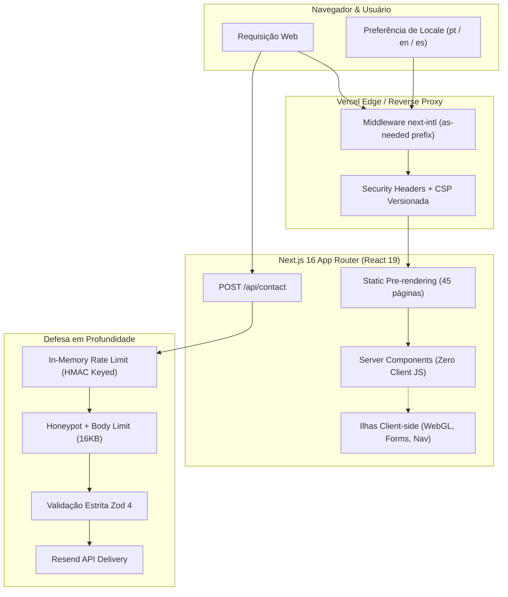

# Roberto Moraes — Portfolio & Engineering

<div align="center">

[](https://nextjs.org/)
[](https://react.dev/)
[](https://www.typescriptlang.org/)
[](https://tailwindcss.com/)
[](https://portifolio-liard-zeta.vercel.app)

[](https://github.com/Rdemora2/Portifolio/actions/workflows/ci.yml)
[](https://nodejs.org/)
[](https://www.npmjs.com/)
[](https://www.w3.org/WAI/standards-guidelines/wcag/)
[](https://github.com/Rdemora2/Portifolio/actions/workflows/ci.yml)

<br />

**Engenharia Full Stack de Missão Crítica · Arquitetura Distribuída · Liderança Técnica**

[🌐 **Live Preview (Vercel)**](https://portifolio-liard-zeta.vercel.app) &nbsp;|&nbsp;
[📑 **Contexto Técnico & Arquitetura**](./docs/TECHNICAL_CONTEXT.md) &nbsp;|&nbsp;
[💼 **LinkedIn**](https://www.linkedin.com/in/robertomoraes/) &nbsp;|&nbsp;
[📫 **Contato**](https://portifolio-liard-zeta.vercel.app/contato)

</div>

---

## 🧭 Visão Geral

Portfólio profissional de engenharia de software e gestão técnica de **Roberto Moraes**, construído com **Next.js 16 (App Router)** e **React 19**. O projeto combina uma experiência editorial refinada, efeitos visuais progressivos em WebGL/OGL e limites deliberados de performance, segurança defensiva e acessibilidade rigorosa.

A aplicação é pré-renderizada de ponta a ponta em três idiomas (**Português**, **Inglês** e **Espanhol**), com Server Components como padrão absoluto, gates de bundle automatizados e suporte nativo a dois ambientes de entrega: **Vercel** (deploy principal de borda) e **Docker Distroless** (para ambientes auto-hospedados).

> [!NOTE]
> Este README serve como portal executivo e operacional. O detalhamento exaustivo de fluxos, decisões arquiteturais, contratos de API e procedimentos de sustentação estão centralizados em [docs/TECHNICAL_CONTEXT.md](./docs/TECHNICAL_CONTEXT.md).

---

## 🏛️ Pilares de Engenharia



### ⚡ Performance & Zero-Runtime Overhead
- **Server-First**: Mais de 90% do HTML é servido pré-renderizado diretamente do build; o JavaScript é reservado exclusivamente para interações essenciais.
- **Orçamentos de Bundle Estritos**: 49 gates monitoram JS, CSS, HTML, preload de fontes WOFF2 e inventário para as 9 superfícies da aplicação, incluindo privacidade.
- **Motion Progressivo**: Efeito *LiquidChrome* construído sobre **OGL 1.0** e Web Animations API. Degrada suave e funcionalmente para fundos estáticos em cenários com `prefers-reduced-motion` ou sem WebGL.

### 🌐 Internacionalização Nativa (i18n)
- Suporte nativo a **Português** (`/`), **Inglês** (`/en`) e **Espanhol** (`/es`) via `next-intl`.
- Prefixo somente sob demanda (*as-needed*): a raiz permanece canônica em português, sem redirecionamentos desnecessários.
- Metadados completos: `hreflang`, canonical links, Open Graph dinâmico e JSON-LD Schema.org localizado.

### 🛡️ Segurança Defensiva & Resiliência
- **Content Security Policy (CSP)** versionada com `script-src-attr: 'none'`, `frame-ancestors: 'none'` e `base-uri: 'self'`; o bootstrap atual ainda requer `unsafe-inline` para scripts e estilos.
- Route Handler `/api/contact` protegido contra abuso:
  - Rate limiting em memória com teto de entradas; IPs confiáveis são transformados em HMAC antes de entrar no mapa.
  - Verificação de entropia Shannon para segredos de ambiente.
  - Limite rígido de payload (16 KiB) e timeout por `Promise.race`; o timeout não cancela uma entrega já iniciada.
  - Detecção de spam via honeypot transparente.
  - Confiança explícita de proxy através de `CONTACT_TRUST_PROXY`; os contadores continuam locais a cada processo.
  - Retentativa manual com chave de idempotência estável e resultado indeterminado documentado para respostas 504.

Os checks de segurança da CI incluem auditoria npm, verificação de assinaturas, Trivy da imagem e SBOM CycloneDX. O badge indica a existência desse pipeline; não certifica ausência permanente de vulnerabilidades. Veja também o [runbook do contato](./docs/CONTACT_OPERATIONS.md).

### ♿ Acessibilidade (a11y) & SEO Estruturado
- Conformidade auditada com **WCAG 2.1 AAA** usando `@axe-core/playwright`.
- Links acessíveis de salto de conteúdo (*Skip to Content*), landmarks HTML5 semânticos e foco gerenciado no teclado.
- Marcação Schema.org enriquecida com `Person`, `WebSite`, `CreativeWork`, `BreadcrumbList`, `Occupation` e identificadores canônicos da **Wikidata**.
- Rastreabilidade para agentes de inteligência artificial via `llms.txt` e `llms-full.txt`.

---

## 💼 Casos de Engenharia & Vitrine

### Projetos de Missão Crítica Documentados

| Case Study | Escopo & Impacto | Stack Principal |
| :--- | :--- | :--- |
| **[Hospital Sírio-Libanês](https://portifolio-liard-zeta.vercel.app/projetos/hospital-sirio-libanes)** | Plataforma de saúde para 350.000+ pacientes, telemedicina e agendamento digital com SLA de 99.98%. | Go · NestJS · Next.js · AWS · PostgreSQL |
| **[Grupo Bandeirantes](https://portifolio-liard-zeta.vercel.app/projetos/band-news-bandsports)** | Modernização simultânea de 6+ portais (BandNews, BandSports, Arte 1, Agro+) com zero downtime em picos de audiência. | Next.js · Go · AWS WAF · Load Balancing · TypeScript |
| **[Grupo Posadas / Fiesta Americana](https://portifolio-liard-zeta.vercel.app/projetos/fiesta-americana)** | Motor de reservas e portal hoteleiro internacional para mais de 190 propriedades com US$ 25M+ em reservas processadas. | Next.js · NestJS · AWS · GCP · Micro frontends |
| **[Buser](https://portifolio-liard-zeta.vercel.app/experiencia)** | Engenharia de alta volumetria com R$ 150M+ transacionados e 10M+ usuários ativos em mobilidade urbana. | Kotlin · Go · AWS · Microsserviços · CI/CD |

### Vitrine de Produtos & Experiências Publicadas

| Produto | Segmento & Foco | Demonstração |
| :--- | :--- | :---: |
| **Aruá Resort Experience** | Hospitalidade de luxo, reservas e narrativa visual responsiva | [Acessar ↗](https://lp-hospitalidade-premium.vercel.app/) |
| **Portal de Notícias Atual** | Design editorial imersivo, tipografia de alta fidelidade e SEO | [Acessar ↗](https://portal-noticias-ivory.vercel.app/) |
| **Carla Moraes Arquitetura** | Galeria institucional com WebP otimizado e layout minimalista | [Acessar ↗](https://lp-arq-carla-moraes.vercel.app/) |
| **Casa Brasa Tabacaria** | Identidade de marca, catálogo e transições fluidas | [Acessar ↗](https://casa-brasa-tabacaria.vercel.app/) |
| **Estúdio Musical Sonoridades** | Engenharia de interface e showcase multimídia | [Acessar ↗](https://lp-estudio-musica.vercel.app/) |
| **Solum Paisagismo** | Interface institucional responsiva e direção de arte moderna | [Acessar ↗](https://lp-institucional-paisagismo.vercel.app/) |

---

## 🛠️ Stack Tecnológica

| Camada | Tecnologia | Propósito no Portfólio |
| :--- | :--- | :--- |
| **Framework** | [Next.js 16.3.0](https://nextjs.org/) | App Router, Server Components, Route Handlers e compilação Turbopack |
| **Biblioteca UI** | [React 19.2.4](https://react.dev/) | Primitivas modernas de renderização e hidratação seletiva |
| **Tipagem** | [TypeScript 5](https://www.typescriptlang.org/) | Tipagem estrita de rotas (`typedRoutes: true`) e contratos de dados |
| **Estilização** | [Tailwind CSS 4](https://tailwindcss.com/) + CSS Modules | Estilos utilitários de alta performance e design system customizado |
| **WebGL & Shaders** | [OGL 1.0.11](https://github.com/oframe/ogl) | Renderizador WebGL ultraleve para efeito de fluido (*LiquidChrome*) |
| **Motion & Interação** | Web Animations API + CSS Transitions | Animações declarativas e reveals sem sobrecarga de bibliotecas externas |
| **Internacionalização** | [next-intl 4.13.7](https://next-intl-docs.vercel.app/) | Catálogos de mensagens em PT, EN e ES com Server Components |
| **Formulários & Schemas**| [React Hook Form 7.74](https://react-hook-form.com/) + [Zod 4.4](https://zod.dev/) | Validação de entrada client-side e integridade tipada |
| **Entrega Transacional** | [Resend 6.17.2](https://resend.com/) | API moderna de envio de emails transacionais autenticados |
| **Testes Unitários** | [Vitest 4.1.10](https://vitest.dev/) | Contratos automatizados de lógica, conteúdo e configuração |
| **Testes E2E & A11y** | [Playwright 1.61](https://playwright.dev/) + [axe-core](https://www.deque.com/axe/) | Automação cross-browser (Chromium, Firefox, WebKit, Mobile) e WCAG |
| **Infra & Deploy** | [Vercel](https://vercel.com/) + [Docker Distroless](https://github.com/GoogleContainerTools/distroless) | Hospedagem em Edge global e container imutável não-root |

---

## 📊 Matriz de Orçamentos de Performance (Bundle Budgets)

O comando `npm run check:bundle` valida todas as superfícies da aplicação contra limites rígidos de transferência comprimida (gzip nível 9) e inventário de fontes:

| Superfície | JS Máximo | CSS Máximo | HTML Máximo | Font Preload | Font Inventory |
| :--- | :---: | :---: | :---: | :---: | :---: |
| **Home (`/`)** | 260 KiB | 25 KiB | 60 KiB | 120 KiB | 210 KiB |
| **Work (`/work`)** | 250 KiB | 25 KiB | 35 KiB | 120 KiB | 210 KiB |
| **Case Study (`/work/[slug]`)** | 245 KiB | 25 KiB | 20 KiB | 120 KiB | 210 KiB |
| **Experience (`/experience`)** | 245 KiB | 25 KiB | 22 KiB | 120 KiB | 210 KiB |
| **About (`/about`)** | 245 KiB | 25 KiB | 40 KiB | 120 KiB | 210 KiB |
| **Insights (`/insights`)** | 245 KiB | 25 KiB | 18 KiB | 120 KiB | 210 KiB |
| **Contact (`/contact`)** | 250 KiB | 25 KiB | 18 KiB | 120 KiB | 210 KiB |
| **Article (`/insights/[slug]`)**| 250 KiB | 25 KiB | 35 KiB | 120 KiB | 210 KiB |
| **Privacy (`/privacy`)** | 245 KiB | 25 KiB | 18 KiB | 120 KiB | 210 KiB |
| **Lazy Chunks (Diferidos)** | 175 KiB (Total) | — | — | — | 90 KiB (Maior chunk) |

---

## 💻 Guia de Execução Local

### Pré-requisitos
- **Node.js**: `>=24.18.0 <25` (recomendado: `v24.18.0` via `.nvmrc`).
- **npm**: `11.16.0` (declarado em `packageManager`).
- **Docker**: versão 24+ (opcional, para execução em container isolado).

### Instalação & Inicialização

```bash
# 1. Alinhar a versão do Node.js
nvm use

# 2. Instalação estrita com verificação de integridade
npm ci

# 3. Configurar ambiente de desenvolvimento local
cp .env.example .env.development.local

# 4. Iniciar servidor de desenvolvimento (protegido por watchdog de memória)
npm run dev
```

Acesse a aplicação em [http://localhost:3000](http://localhost:3000).

> [!TIP]
> O servidor de desenvolvimento inclui um watchdog nativo que limita o consumo de memória heap do V8 e encerra o processo preventivamente se a árvore ultrapassar o limite seguro, protegendo a máquina de travamentos.

---

## 🧪 Suíte de Testes & Qualidade

Para reproduzir localmente o pipeline idêntico de CI:

```bash
# 1. Testes unitários e contratos de mensagens
npm test

# 2. Linter e regras estritas de Core Web Vitals
npm run lint

# 3. Verificação tipada e geração de tipos de rotas Next.js
npm run typecheck

# 4. Build de produção com Turbopack
npm run build

# 5. Auditoria de budgets de transferência
npm run check:bundle

# 6. Testes ponta a ponta (E2E) com Playwright
npm run test:e2e
```

### Comandos do Projeto

| Script | Ação |
| :--- | :--- |
| `npm run dev` | Inicia o servidor de desenvolvimento com Webpack e limites de memória |
| `npm run dev:turbo` | Inicia o desenvolvimento com Turbopack opt-in |
| `npm test` | Executa a suíte Vitest e o quality hook de IA |
| `npm run lint` | Executa o ESLint 9 com regras do Next.js e TypeScript |
| `npm run typecheck` | Gera tipos de rota e roda checagem do compilador TypeScript (`tsc --noEmit`) |
| `npm run build` | Compila o build estático de produção e prepara o standalone |
| `npm run check:bundle` | Analisa os artefatos compilados contra a matriz de orçamentos de bundle |
| `npm run test:e2e` | Roda testes ponta a ponta Playwright em navegadores desktop, mobile e a11y |
| `npm run analyze` | Abre a análise estática do bundle via Turbopack |

---

## 🚀 Deploy & Produção

### 1. Deploy na Vercel (Produção Primária)
O repositório é otimizado nativamente para a plataforma **Vercel**:
- Quando detectado `VERCEL=1`, o Next.js utiliza seu adaptador nativo de deployment de borda.
- Os scripts de standalone são automaticamente ignorados para garantir artefatos otimizados pela infraestrutura da plataforma.
- Métricas de telemetria [Vercel Analytics](https://vercel.com/analytics) e [Speed Insights](https://vercel.com/speed-insights) são ativadas sob demanda.

### 2. Imagem Docker Distroless (Auto-hospedagem)
Para execuções locais ou infraestrutura própria:
- Container multi-stage que compila sobre Debian e executa sobre uma imagem **Google Distroless** (`base-nossl` Debian 13).
- Não contém shell, package manager ou ferramentas que possam ser exploradas em invasões.
- Executa com usuário não-root (`UID/GID 65532:65532`) e sistema de arquivos somente leitura (*read-only rootfs*).

```bash
# Build e execução via Docker Compose
docker compose --env-file .env.production up --build -d
```

---

## 📂 Estrutura do Repositório

```text
Portifolio/
├── .github/
│   ├── workflows/ci.yml       # Pipeline completo de CI (testes, lint, e2e, trivy, sbom)
│   └── instructions/          # Guias de governança para agentes e desenvolvedores
├── docs/
│   ├── CONTACT_OPERATIONS.md  # Runbook de rate limit, timeout e idempotência
│   └── TECHNICAL_CONTEXT.md   # Documento mestre de arquitetura e decisões técnicas
├── e2e/                       # Testes de integração e acessibilidade com Playwright
├── public/                    # Assets públicos estáticos, thumbnails WebP e llms.txt
├── scripts/                   # Scripts de bundle budget, dev server e standalone
├── src/
│   ├── app/                   # App Router Next.js (rotas, layouts, metadata e /api)
│   ├── components/            # Componentes React (layout, seções, vitrine, WebGL)
│   ├── content/               # Artigos e publicações editoriais pré-renderizadas
│   ├── data/                  # Fontes de verdade de projetos, experiências e links
│   ├── hooks/                 # React Hooks customizados (viewport, scroll)
│   ├── i18n/                  # Configurações do next-intl e carregamento de mensagens
│   ├── lib/                   # Utilitários de segurança, validações Zod e WebGL
│   ├── messages/              # Dicionários de tradução (pt.json, en.json, es.json)
│   └── types/                 # Definições tipadas e contratos TypeScript
├── next.config.ts             # Configuração Next.js, CSP e headers de segurança
└── package.json               # Dependências, scripts e configurações de engine
```

---

## 📬 Contato & Conexões

- **Website**: [portifolio-liard-zeta.vercel.app](https://portifolio-liard-zeta.vercel.app)
- **LinkedIn**: [linkedin.com/in/robertomoraes](https://www.linkedin.com/in/robertomoraes/)
- **Email**: [robertomoraeszar@gmail.com](mailto:robertomoraeszar@gmail.com)
- **WhatsApp**: [+55 11 97387-4345](https://api.whatsapp.com/send?phone=5511973874345)
- **GitHub**: [@Rdemora2](https://github.com/Rdemora2)

---

<div align="center">
  <sub>Construído com obsessão por qualidade de software, arquitetura limpa e performance.</sub>
</div>
